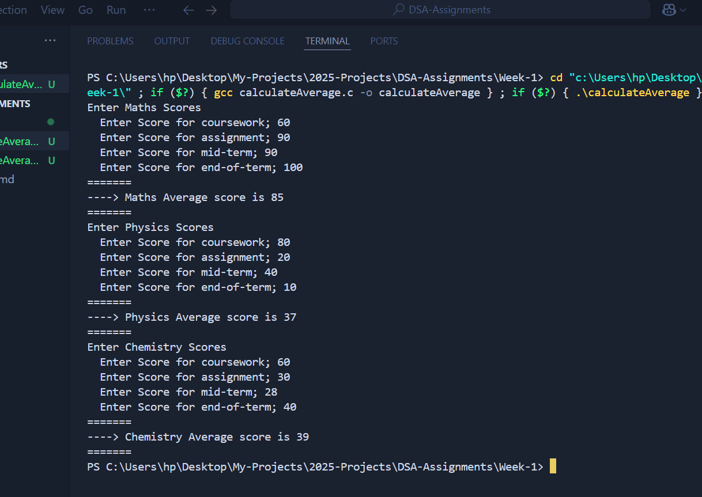

# DSA-Assignments
Collection of Assignments on Data Structures and Algorithms

### 1. Assignment One - Calculate Average Score
```
/**
 Question:
 Write a C program that calculates the average of marks obtained by a student in 3 subjects. 
 That is physics, chemistry and maths. Assume for each subject, 4 different tests were conducted;
 - coursework
 - assignment
 - mid-term
 - end-of-term
 */
```

[Click here to see the C program that solves this.](./Week-1/calculateAverage.c)

#### Screen shot of the output
