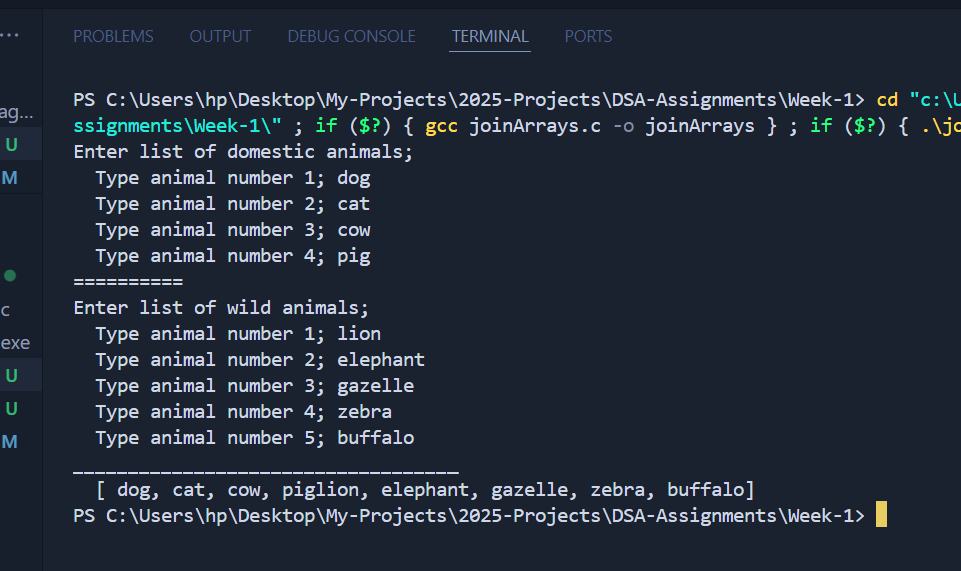

# DSA-Assignments
Collection of Assignments on Data Structures and Algorithms


## Week Two
👉📍 We learned about Algorithms and Perfrmance analysis.

[Click here for the solutions to class assignments](./Week-2-Algorithms&BigOh/solutions.md)


## Week One

### 1. Assignment One - Calculate Average Score
```
/**
 Question:
 Write a C program that calculates the average of marks obtained by a student in 3 subjects. 
 That is physics, chemistry and maths. Assume for each subject, 4 different tests were conducted;
 - coursework
 - assignment
 - mid-term
 - end-of-term
 */
```

[Click here to see the C program that solves this.](./Week-1/calculateAverage.c)

#### Screen shot of the output


### 2. Assignment Two - Join Arrays of wild Animals
```
/**
 Question:
 Write a C program that accepts a group of; 
 - N domestic animals and a group of
 - and X wild animals
 your program should print (n+x) animals after entering each group
*/
```
[Click here to see the C program that solves this.](./Week-1/joinArrays.c)

#### Screen shot of the output

